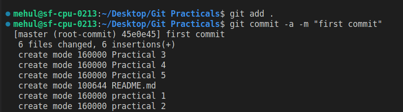
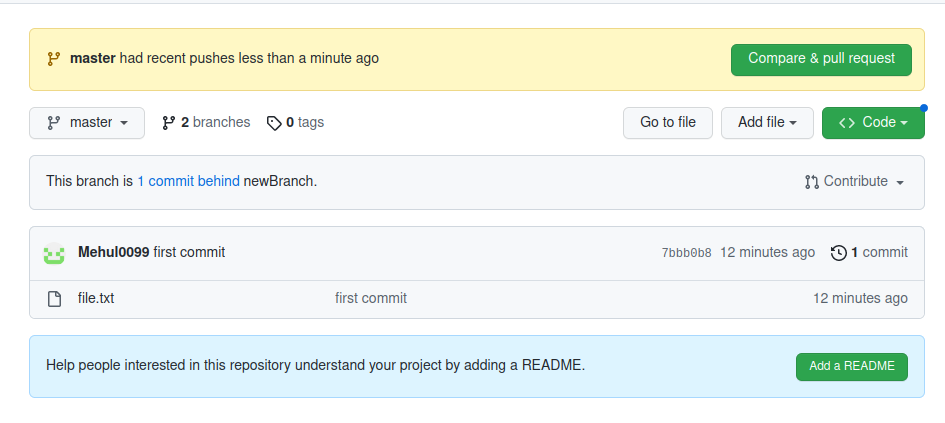

## Some basic Git commands that are used in Practicals

### 1. Init 
  The git init command creates a new Git repository on your local machine. 
```
git init
```
### 2. Add
Git add command add the untrackable or changed file into staging area.

```
# for all file
git add .

# specific file
git add {file name}
```
### 3. Commit

To record the changes in git, commit command is used.



### Link the remote repository & Push
   
```
git remote add origin <link>
git push origin master
```


# Practical 1 : Pull & Merge difference
Git pull command is fetch the history from remote branch and merge it into current branch. 


