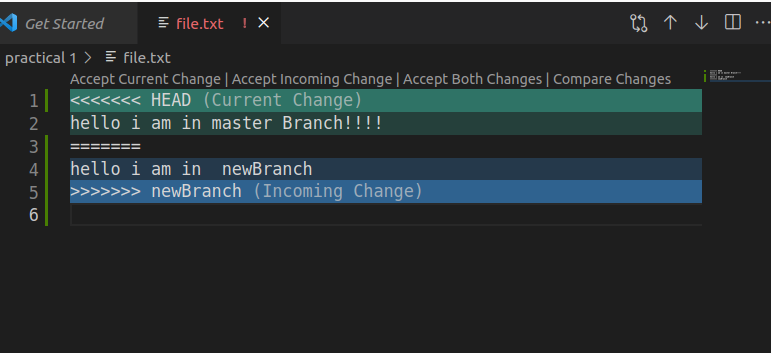
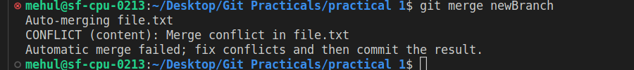
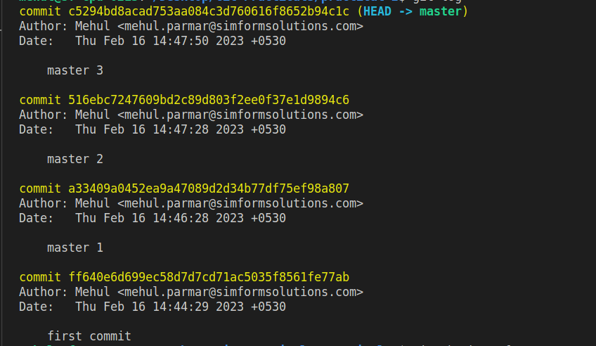
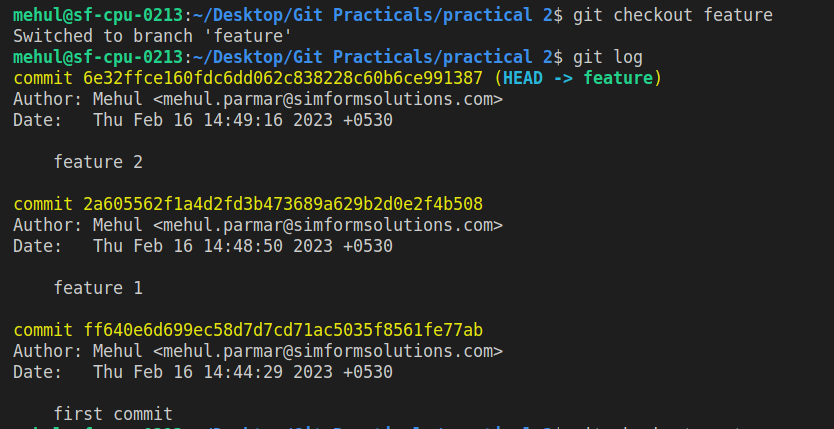
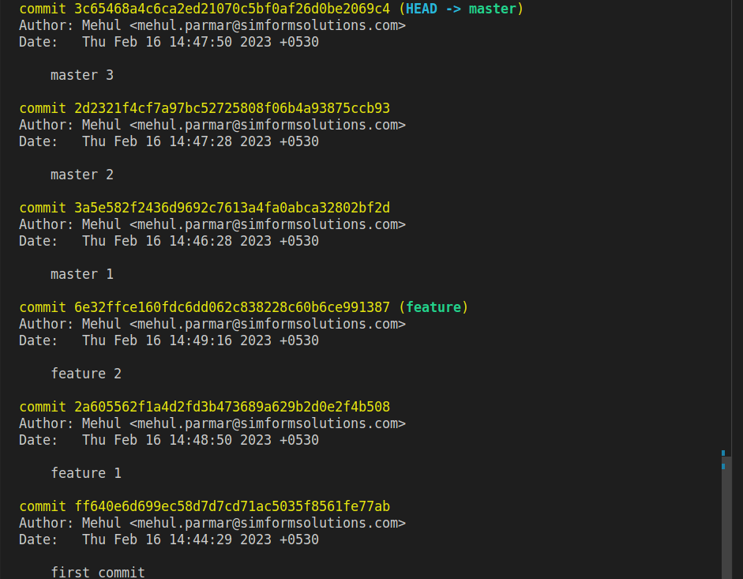

## Some basic Git commands that are used in Practicals

### 1. Init 
  The git init command creates a new Git repository on your local machine. 
```
git init
```
### 2. Add
Git add command add the untrackable or changed file into staging area.

```
# for all file
git add .

# specific file
git add {file name}
```
### 3. Commit

To record the changes in git, commit command is used.


### Link the remote repository & Push
   
```
git remote add origin <link>
git push origin master
```


# Practical 1 : Pull & Merge difference
Git pull command is fetch the history from remote branch and merge it into current branch. 
    
```
git pull origin master
```


Pull request is used to request the user to pull the code from our repository or branch.
The owner can review changes, approve them and merge the changes.
    
```
git pull origin master
```




Git merge command merge current branch with target branch.

    
```
git merge master
```



# Practical 2 : Rebase
Git rebase command take all commit of target branch and add inside current branch as it is. It is the process of moving or combining a sequence of commits to a new base commit.

```
git rebase {target branch}
```
first doing three commits in master branch



now switch into a feature branch and doing a two commits



after applying rebase :



